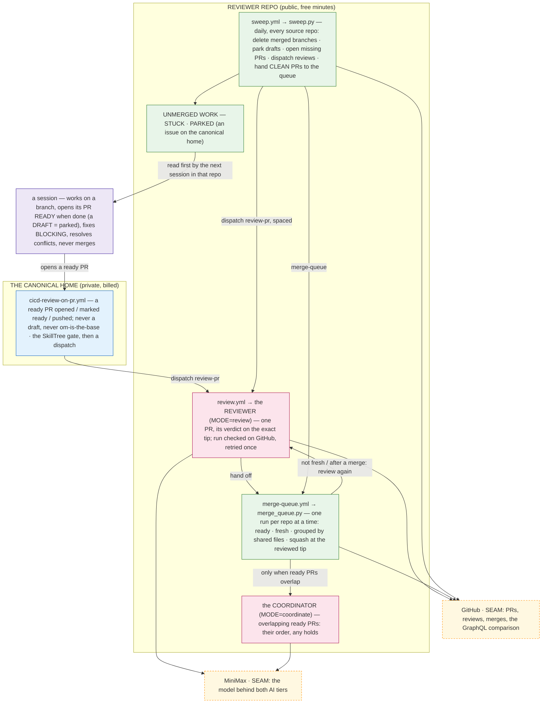

# 21 — THE CI: THE ARCHITECTURE MAP

<docsys kind="arch-map" role="instance"/>

TRIGGER:[a change to `../../DESIGN.md` that adds, removes or re-wires a trigger, a workflow, a tier or a repo policy
(⇒ redraw here, same turn)]

Arrows point from what fires to what it runs. Everything under REVIEWER REPO runs on the public `sancovp/cicd-reviewer`.

